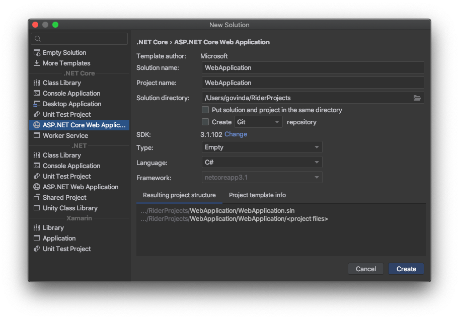
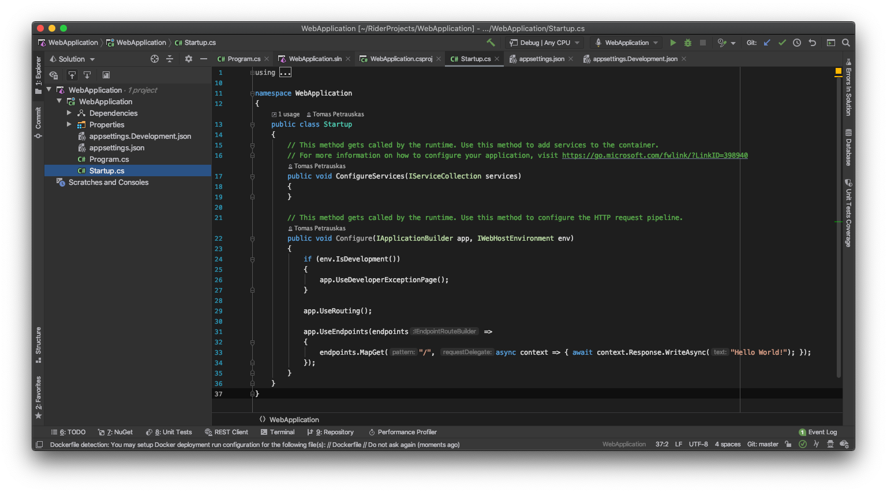
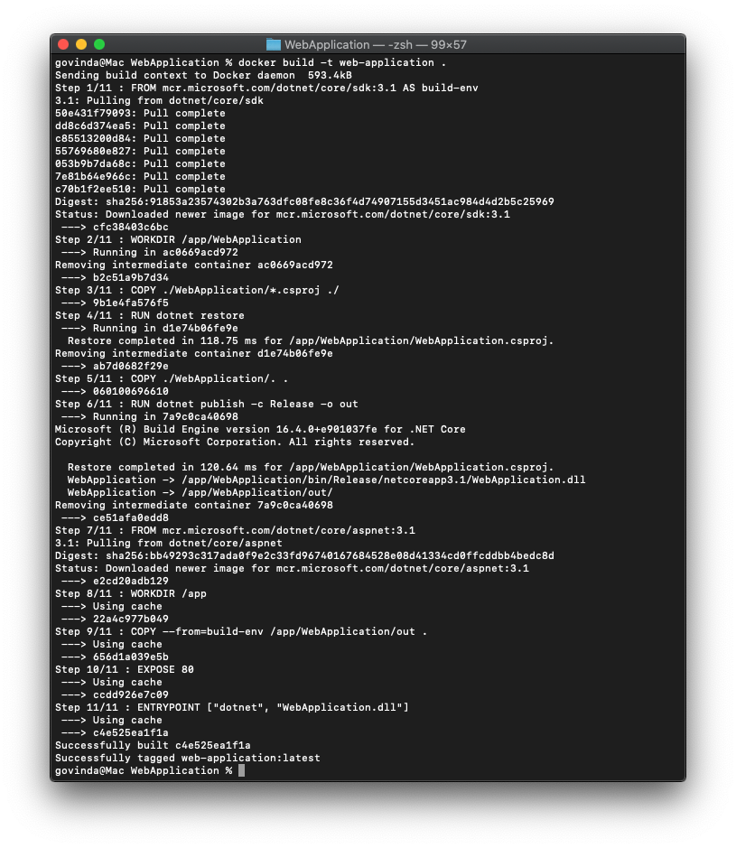
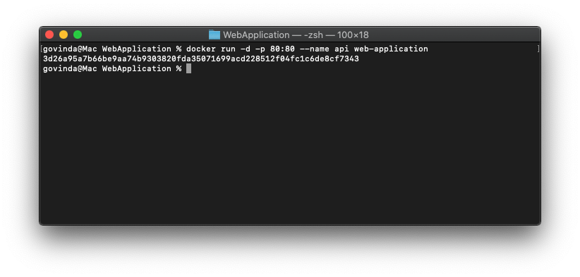
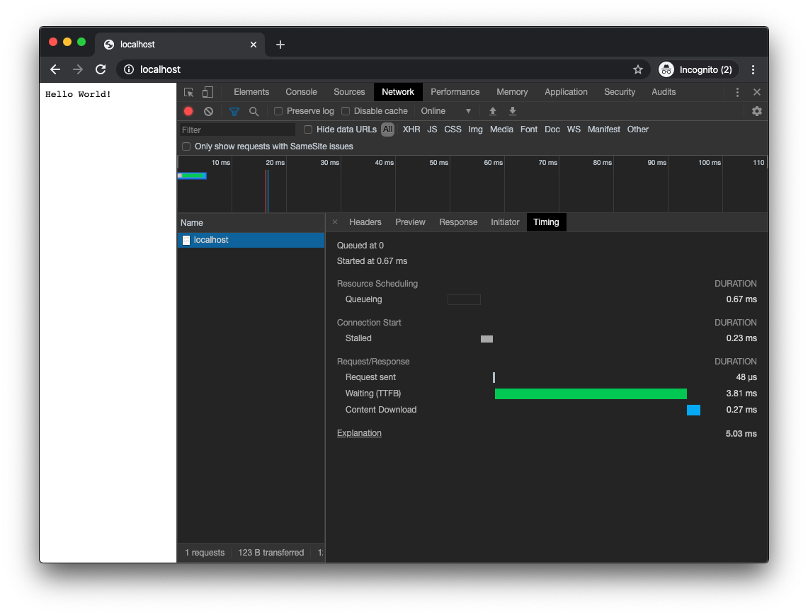
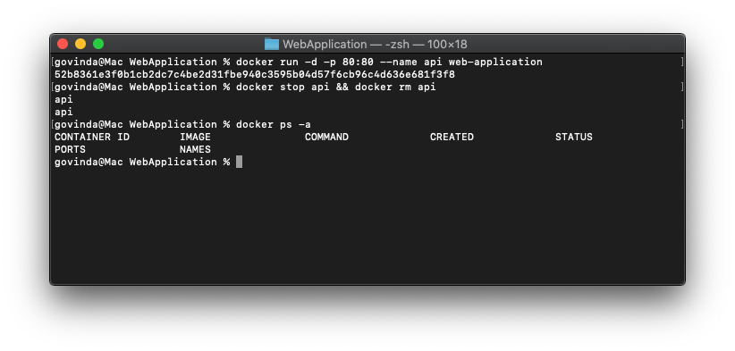

# Sample Application

Use sample code to create .NET Core Web Application

# Docker Ignore
To build an application we only need Source Code, let's ignore unnecessary files like *./obj* or *./bin*.

# Dockerfile
We will use Microsoft official [SDK](https://hub.docker.com/_/microsoft-dotnet-core-sdk/) and [Runtime](https://hub.docker.com/_/microsoft-dotnet-core-aspnet/) Docker Containers to Build and Run .NET Core Application. This will make Application Container lighter since it will not include Source Code, only artifacts and libraries etc.

# Build

Build Docker Container from *Dockerfile* file in current directory:
`docker build -t web-application .`

# Execute

Run built web-application container in detached mode with *api* name and *Port 80* accessible to *localhost*:
`docker run -d -p 80:80 --name api web-application`

# Test

To test if Application runs, open [http://localhost](http://localhost) URL in a Web Browser.

# Stop and Remove Container

`docker stop api && docker rm api`

